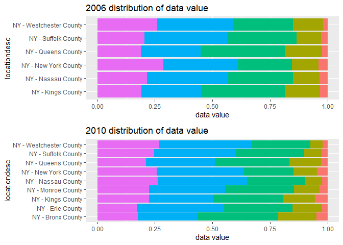

HW3
================
Nankun
2019/10/13

# Homework 3

## Library

``` r
library(tidyverse)
```

    ## -- Attaching packages ---------------------------------- tidyverse 1.2.1 --

    ## √ ggplot2 3.2.1     √ purrr   0.3.2
    ## √ tibble  2.1.3     √ dplyr   0.8.3
    ## √ tidyr   1.0.0     √ stringr 1.4.0
    ## √ readr   1.3.1     √ forcats 0.4.0

    ## -- Conflicts ------------------------------------- tidyverse_conflicts() --
    ## x dplyr::filter() masks stats::filter()
    ## x dplyr::lag()    masks stats::lag()

``` r
library(ggridges)
```

    ## 
    ## Attaching package: 'ggridges'

    ## The following object is masked from 'package:ggplot2':
    ## 
    ##     scale_discrete_manual

``` r
library(patchwork)
library(readr)
library(p8105.datasets)
```

## Problem 1

### Number of aisle and the most popular one

``` r
data("instacart")
ais_num = 
  max(pull(instacart,aisle_id))
ais_num
```

    ## [1] 134

``` r
pop_ais=
instacart %>% 
  group_by(aisle) %>% 
  summarize(
    n_ais = n()
  ) %>% 
  arrange(desc(n_ais)) %>% 
  filter(min_rank(desc(n_ais))<2) %>% 
  pull(aisle)
pop_ais
```

    ## [1] "fresh vegetables"

**Answer**: There are 134 aisle and fresh vegetable is the most item
ordered from.

### Plot

``` r
instacart %>% 
  group_by(aisle) %>% 
  summarize(
    n_ais = n()
  ) %>% 
  filter(n_ais > 10000) %>% 
  ggplot(aes(x = aisle, y = n_ais)) +
  geom_point() +
  labs(
    title = "Aisle orders plot",
    x = "Aisle names",
    y = "Order amount",
    caption = "Data from instacart"
  ) +
  ggthemes::theme_excel()+
  theme(axis.text.x = element_text(angle = 90,hjust=1))
```

<!-- -->

**Answer**: The plot is showing above, including the order count for all
aisles with more than 10000 items ordered.

### 3 most popular in three aisles

``` r
instacart %>% 
  filter(aisle == "baking ingredients"|aisle ==  "dog food care"|aisle ==  "packaged vegetables fruits") %>% 
  group_by(aisle, product_name) %>% 
  summarize(
    sum = sum(order_number)
  ) %>% 
filter(min_rank(desc(sum))<=3) %>% 
  arrange(desc(sum)) %>% 
 knitr::kable()
```

| aisle                      | product\_name                                 |    sum |
| :------------------------- | :-------------------------------------------- | -----: |
| packaged vegetables fruits | Organic Baby Spinach                          | 171301 |
| packaged vegetables fruits | Organic Raspberries                           | 113932 |
| packaged vegetables fruits | Organic Blueberries                           |  86765 |
| baking ingredients         | Light Brown Sugar                             |   8605 |
| baking ingredients         | Cane Sugar                                    |   6244 |
| baking ingredients         | Organic Vanilla Extract                       |   6003 |
| dog food care              | Standard Size Pet Waste bags                  |    675 |
| dog food care              | Beef Stew Canned Dog Food                     |    631 |
| dog food care              | Snack Sticks Chicken & Rice Recipe Dog Treats |    589 |

**Answer**: Table is showing above, including the 3 most popular items
in “baking ingredients”, “dog food care”, and “packaged vegetables
fruits” aisle.

### Table

``` r
  instacart %>% 
  filter(product_name == "Pink Lady Apples"|product_name ==  "Coffee Ice Cream") %>%
  group_by(product_name, order_dow) %>% 
  summarize(
   ohd_mean = mean(order_hour_of_day)
  ) %>% 
   mutate(
     order_dow = recode(order_dow, "0" = "Sun", "1" = "Mon", "2" = "Tue", "3" = "Wed", "4" = "Thu", "5" = "Fri", "6" = "Sat"),
     ohd_mean = round(ohd_mean, 2)
     ) %>% 
    pivot_wider(
    names_from = order_dow,
    values_from = ohd_mean
  ) %>% 
   knitr::kable()
```

| product\_name    |   Sun |   Mon |   Tue |   Wed |   Thu |   Fri |   Sat |
| :--------------- | ----: | ----: | ----: | ----: | ----: | ----: | ----: |
| Coffee Ice Cream | 13.77 | 14.32 | 15.38 | 15.32 | 15.22 | 12.26 | 13.83 |
| Pink Lady Apples | 13.44 | 11.36 | 11.70 | 14.25 | 11.55 | 12.78 | 11.94 |

**Answer**: The table is showing above, including the mean hour of the
day at which Pink Lady Apples and Coffee Ice Cream are ordered on each
day of the week.

**Description**: Data *instacart* from *library(p8105.datasets)*
contains 1384617 observations with 15 variables about the order status
of items.The key varibles we used in data analysis includes *aisle\_id*,
*aisle*, *product\_nam*, *order\_dow*, *order\_hour\_of\_day*, and
*order\_number*. These variables are analysed to get aisle number, the
aisle which most items are ordered from, making plots about the number
of items ordered in each aisle with more than 10000 items ordered,
making table about the most popular items in “baking ingredients”, “dog
food care”, and “packaged vegetables fruits” aisles, and making table
showing that mean hour of the day at which Pink Lady Apples and Coffee
Ice Cream are ordered on each day of the week.

## Problem 2

### Data cleaning

``` r
data("brfss_smart2010")
brfss_td = 
  brfss_smart2010 %>% 
  janitor::clean_names() %>% 
  filter(
    topic == "Overall Health") %>% 
    filter(response=="Excellent"|response=="Very good"|
           response=="Good"|response=="Fair"|
           response=="Poor") %>% 
  mutate(
    response = fct_relevel(response, "Poor", "Fair", "Good", "Very good", "Excellent")
  )
```

    ## Warning in FUN(X[[i]], ...): strings not representable in native encoding
    ## will be translated to UTF-8

``` r
brfss_td
```

    ## # A tibble: 10,625 x 23
    ##     year locationabbr locationdesc class topic question response
    ##    <int> <chr>        <chr>        <chr> <chr> <chr>    <fct>   
    ##  1  2010 AL           AL - Jeffer~ Heal~ Over~ How is ~ Excelle~
    ##  2  2010 AL           AL - Jeffer~ Heal~ Over~ How is ~ Very go~
    ##  3  2010 AL           AL - Jeffer~ Heal~ Over~ How is ~ Good    
    ##  4  2010 AL           AL - Jeffer~ Heal~ Over~ How is ~ Fair    
    ##  5  2010 AL           AL - Jeffer~ Heal~ Over~ How is ~ Poor    
    ##  6  2010 AL           AL - Mobile~ Heal~ Over~ How is ~ Excelle~
    ##  7  2010 AL           AL - Mobile~ Heal~ Over~ How is ~ Very go~
    ##  8  2010 AL           AL - Mobile~ Heal~ Over~ How is ~ Good    
    ##  9  2010 AL           AL - Mobile~ Heal~ Over~ How is ~ Fair    
    ## 10  2010 AL           AL - Mobile~ Heal~ Over~ How is ~ Poor    
    ## # ... with 10,615 more rows, and 16 more variables: sample_size <int>,
    ## #   data_value <dbl>, confidence_limit_low <dbl>,
    ## #   confidence_limit_high <dbl>, display_order <int>,
    ## #   data_value_unit <chr>, data_value_type <chr>,
    ## #   data_value_footnote_symbol <chr>, data_value_footnote <chr>,
    ## #   data_source <chr>, class_id <chr>, topic_id <chr>, location_id <chr>,
    ## #   question_id <chr>, respid <chr>, geo_location <chr>

### State observed

``` r
brfss_td %>% 
  filter(year==2010|year==2002) %>% 
  group_by(year, locationabbr,locationdesc) %>% 
  summarize(
    n = n()
  ) %>% 
    count(locationabbr,name = "obsd") %>% 
    filter(obsd >= 7) %>% 
  pivot_wider(
    names_from = year,
    values_from = obsd
  )
```

    ## # A tibble: 15 x 3
    ## # Groups:   locationabbr [15]
    ##    locationabbr `2002` `2010`
    ##    <chr>         <int>  <int>
    ##  1 CT                7     NA
    ##  2 FL                7     41
    ##  3 MA                8      9
    ##  4 NC                7     12
    ##  5 NJ                8     19
    ##  6 PA               10      7
    ##  7 CA               NA     12
    ##  8 CO               NA      7
    ##  9 MD               NA     12
    ## 10 NE               NA     10
    ## 11 NY               NA      9
    ## 12 OH               NA      8
    ## 13 SC               NA      7
    ## 14 TX               NA     16
    ## 15 WA               NA     10

*Answer*: The states observed equal or more than 7 times in both 2002
and 2010 are shown above.There are 6 state have observed equal or more
than 7 times in 2002, but much more in 2010.

### spaghetti plot

``` r
brfss_td %>% 
  filter(response == "Excellent") %>% 
  group_by(year, locationabbr, locationdesc) %>% 
  summarize(
    ave_val = mean(data_value, na.rm = TRUE),
  ) %>% 
  ggplot(aes(x = year, y = ave_val)) + 
  geom_point() + 
  geom_line(aes(group = locationabbr))+
  labs(
    y="average of data value",
    title = "average value over time within a state"
  )
```

    ## Warning: Removed 6 rows containing missing values (geom_point).

<!-- -->

*Answer*: “spaghetti” plot of this average value over time within a
state is made above.

### two panel plot

``` r
plot_2006 =
  brfss_td %>%
  filter(year == "2006") %>% 
  ggplot(aes(x = response, y = data_value)) + 
  geom_violin(aes(fill = response), color = "blue", alpha = .5) + 
  labs(
    title = "2006 distribution of data value",
    y = "data value"
    )+
  theme(legend.position = "none")
plot_2010 =
  brfss_td %>%
  filter(year == "2010") %>% 
  ggplot(aes(x = response, y = data_value)) + 
  geom_violin(aes(fill = response), color = "blue", alpha = .5) +
  labs(
    title = "2010 distribution of data value",
    y = "data value"
    )+
  theme(legend.position = "none")
plot_2006 / plot_2010
```

    ## Warning: Removed 4 rows containing non-finite values (stat_ydensity).

    ## Warning: Removed 5 rows containing non-finite values (stat_ydensity).

<!-- -->

*Answer*: Two-panel plot is above showing that for the years 2006, and
2010, distribution of *data\_value* for responses (“Poor” to
“Excellent”) among locations in NY State, by patchwork. We can see
that the plot in 2006 has similiar distribution comparing to plot in
2010.

## Problem 3

### data import and cleaning

``` r
accel = read_csv("data/accel_data.csv")
```

    ## Parsed with column specification:
    ## cols(
    ##   .default = col_double(),
    ##   day = col_character()
    ## )

    ## See spec(...) for full column specifications.

``` r
accel_td = 
  accel %>% 
  janitor::clean_names() %>% 
  pivot_longer(
    activity_1:activity_1440,
    names_to = "min_act",
    names_prefix = "activity_",
    values_to = "activity_counts") %>% 
  mutate(
    weekday = recode(day,
      "Friday" = "Weekday",
      "Monday" = "Weekday",
      "Tuesday" = "Weekday",
      "Wednesday" = "Weekday",
      "Thursday" = "Weekday",
      "Saturday" = "Weekend",
      "Sunday" = "Weekend"
    )
  )
accel_td
```

    ## # A tibble: 50,400 x 6
    ##     week day_id day    min_act activity_counts weekday
    ##    <dbl>  <dbl> <chr>  <chr>             <dbl> <chr>  
    ##  1     1      1 Friday 1                  88.4 Weekday
    ##  2     1      1 Friday 2                  82.2 Weekday
    ##  3     1      1 Friday 3                  64.4 Weekday
    ##  4     1      1 Friday 4                  70.0 Weekday
    ##  5     1      1 Friday 5                  75.0 Weekday
    ##  6     1      1 Friday 6                  66.3 Weekday
    ##  7     1      1 Friday 7                  53.8 Weekday
    ##  8     1      1 Friday 8                  47.8 Weekday
    ##  9     1      1 Friday 9                  55.5 Weekday
    ## 10     1      1 Friday 10                 43.0 Weekday
    ## # ... with 50,390 more rows

``` r
accel_td %>% 
  count(day, weekday)
```

    ## # A tibble: 7 x 3
    ##   day       weekday     n
    ##   <chr>     <chr>   <int>
    ## 1 Friday    Weekday  7200
    ## 2 Monday    Weekday  7200
    ## 3 Saturday  Weekend  7200
    ## 4 Sunday    Weekend  7200
    ## 5 Thursday  Weekday  7200
    ## 6 Tuesday   Weekday  7200
    ## 7 Wednesday Weekday  7200

*Description* Data *accel\_td* from *accel\_data.csv* contains 50400
observations with 6 variables about the activity counts for each minute
of a 24-hour day starting at midnight for a observer aged 63 and BMI
25.The key varibles we used in data analysis includes *week*, *day\_id*,
*day*, *min\_act*, *activity\_counts*, *weekday*, and created variable
*day\_act\_counts*. These variables are analysed to reveal the trends of
dayily activity counts.

### Traditional analyses

``` r
accel_day =
accel_td %>% 
  group_by(day_id, day, weekday) %>% 
  summarize(
    day_act_counts = sum(activity_counts)
  )
  knitr::kable(accel_day)
```

| day\_id | day       | weekday | day\_act\_counts |
| ------: | :-------- | :------ | ---------------: |
|       1 | Friday    | Weekday |        480542.62 |
|       2 | Monday    | Weekday |         78828.07 |
|       3 | Saturday  | Weekend |        376254.00 |
|       4 | Sunday    | Weekend |        631105.00 |
|       5 | Thursday  | Weekday |        355923.64 |
|       6 | Tuesday   | Weekday |        307094.24 |
|       7 | Wednesday | Weekday |        340115.01 |
|       8 | Friday    | Weekday |        568839.00 |
|       9 | Monday    | Weekday |        295431.00 |
|      10 | Saturday  | Weekend |        607175.00 |
|      11 | Sunday    | Weekend |        422018.00 |
|      12 | Thursday  | Weekday |        474048.00 |
|      13 | Tuesday   | Weekday |        423245.00 |
|      14 | Wednesday | Weekday |        440962.00 |
|      15 | Friday    | Weekday |        467420.00 |
|      16 | Monday    | Weekday |        685910.00 |
|      17 | Saturday  | Weekend |        382928.00 |
|      18 | Sunday    | Weekend |        467052.00 |
|      19 | Thursday  | Weekday |        371230.00 |
|      20 | Tuesday   | Weekday |        381507.00 |
|      21 | Wednesday | Weekday |        468869.00 |
|      22 | Friday    | Weekday |        154049.00 |
|      23 | Monday    | Weekday |        409450.00 |
|      24 | Saturday  | Weekend |          1440.00 |
|      25 | Sunday    | Weekend |        260617.00 |
|      26 | Thursday  | Weekday |        340291.00 |
|      27 | Tuesday   | Weekday |        319568.00 |
|      28 | Wednesday | Weekday |        434460.00 |
|      29 | Friday    | Weekday |        620860.00 |
|      30 | Monday    | Weekday |        389080.00 |
|      31 | Saturday  | Weekend |          1440.00 |
|      32 | Sunday    | Weekend |        138421.00 |
|      33 | Thursday  | Weekday |        549658.00 |
|      34 | Tuesday   | Weekday |        367824.00 |
|      35 | Wednesday | Weekday |        445366.00 |

*Trend* I do not see much trend here, the only trend I see is that the
Saturday counts in last two weeks are very low.

### plot

``` r
accel_day %>% 
  ggplot(aes(x = day_id, y = day_act_counts)) + 
  geom_point(aes(color = day), alpha = .5)+
  geom_line(aes(color = day))+
  labs(
    title = "activity by day plot",
    x = "day",
    y = "activity counts",
    caption = "from accel data"
  )+
   scale_y_continuous(
    breaks = c(0, 200000, 400000, 600000), 
    labels = c("0", "20k", "40k", "60k"))
```

<!-- -->

*Trend* From plot, we can see that the activity counts in weekdays are
kept almost the same, but the counts of activity in weekends drop
obveriously.
